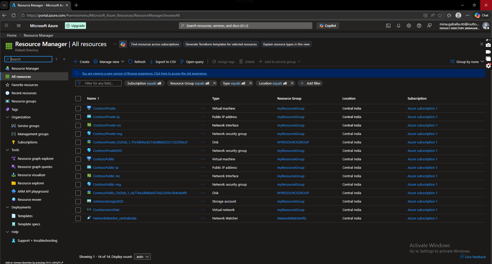
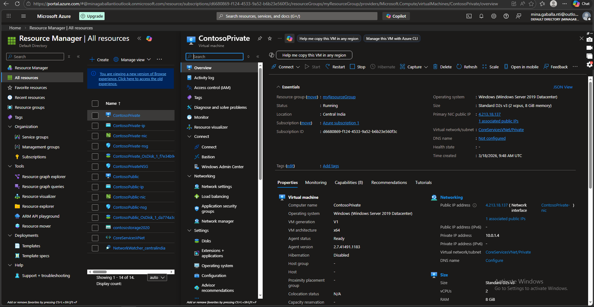
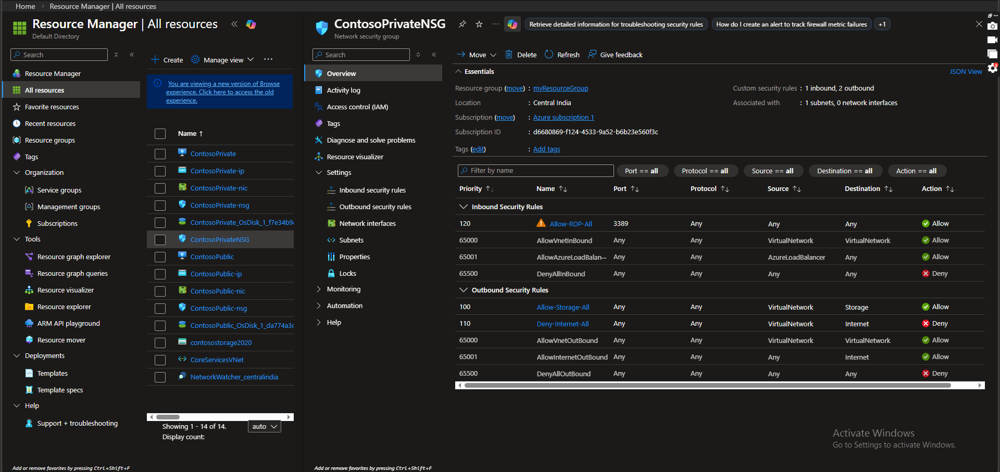
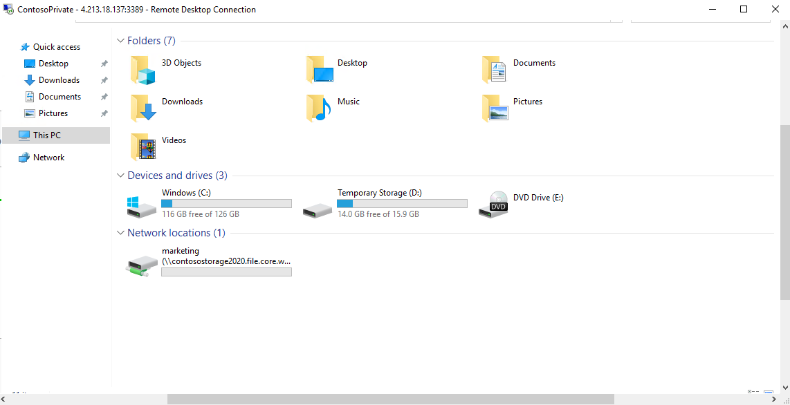

# 🌍 Azure Storage Private Access Lab (Central India)

This lab demonstrates how to design and implement **secure private access to Azure Storage (File Share)** using **Virtual Network Service Endpoints** and restricted subnet access.

---

## 📋 Lab Overview

In this lab, we deployed a secure Azure environment where access to a storage account is restricted to a specific subnet within a virtual network.

The solution ensures that:

* The storage account is **not exposed to the public internet**
* Only resources inside the **Private Subnet** can access the storage
* Traffic is controlled using **Network Security Groups (NSGs)** and **Service Endpoints**

---

## 🏗️ Architecture

* Virtual Network: **CoreServicesVNet**
* Subnets:

  * Public Subnet
  * Private Subnet
* Virtual Machines:

  * ContosoPublic (Management VM)
  * ContosoPrivate (Private access VM)
* Network Security Groups (NSGs)
* Azure Storage Account (File Share)
* Region: Central India

---

## 📸 Screenshots

### 🔹 All Resources  
👉 [View Image](./all-resources.PNG)



---

### 🔹 Private VM (RDP Connection)  
👉 [View Image](./private-vm-rdp.PNG)



---

### 🔹 NSG Rules Configuration  
👉 [View Image](./nsg-rules.PNG)



---

### 🔹 File Share Mounted on VM  
👉 [View Image](./file-share-mounted.PNG)


---

## 📁 ARM Templates

👉 Deployment Template: [VMs.json](./VMs.json)

👉 Parameters File: [VMs.parameters.json](./VMs.parameters.json)

---

## 🚀 Deployment Steps

```powershell
$RGName = "myResourceGroup"

New-AzResourceGroupDeployment `
  -ResourceGroupName $RGName `
  -TemplateFile VMs.json `
  -TemplateParameterFile VMs.parameters.json `
  -adminPassword (Read-Host -AsSecureString)
```

---

## 🔐 Secure File Share Access

```powershell
$acctKey = ConvertTo-SecureString -String "<YOUR-STORAGE-KEY>" -AsPlainText -Force

$credential = New-Object System.Management.Automation.PSCredential -ArgumentList "Azure\contosostorage2020", $acctKey

New-PSDrive -Name Z -PSProvider FileSystem -Root "\\contosostorage2020.file.core.windows.net\marketing" -Credential $credential -Persist
```

---

## 🔒 Security Implementation

* Public access is restricted
* Storage allows access only from:

  * CoreServicesVNet → Private Subnet
* Service Endpoint enabled
* NSG rules applied
* RDP allowed for management only

---

## 🎯 Key Learning Outcomes

* Implement Service Endpoints
* Restrict PaaS access to subnet
* Secure Azure Storage
* Apply NSG rules
* Design private access architecture

---

## 👨‍💻 Author

**Mina Gaballa**
Azure Administrator | Cloud Engineer

🔗 https://github.com/mina-gaballa
